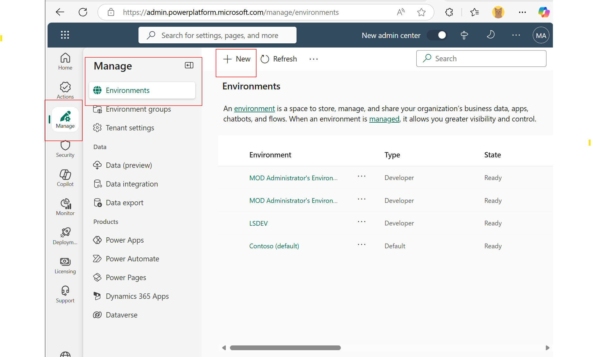
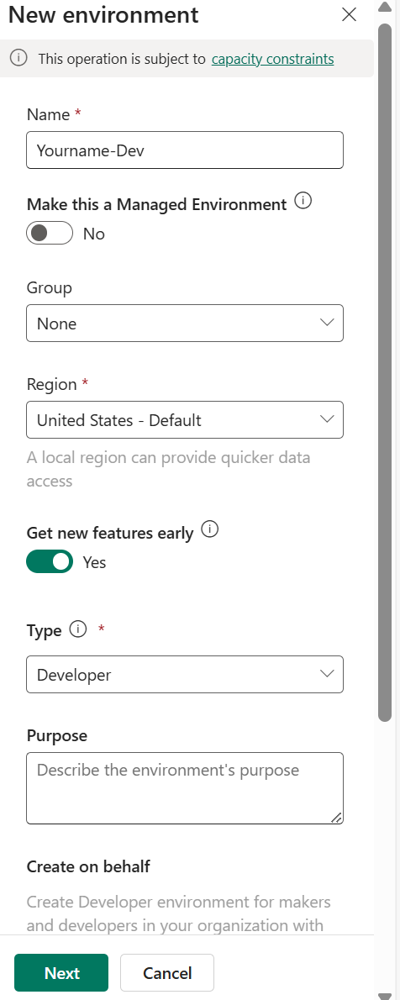

#  Create a Developer Power Platform Environment

> **Important:** Use the Microsoft 365 Edge Browser profile where your **hackathon account** is set up.  
> Always check **which environment you're in** before building or testing anything.

---

## Step 1: Open Power Platform Admin Center

Go to the Power Platform Admin Center:

[https://aka.ms/ppac](https://aka.ms/ppac)

This will redirect you to the admin portal:  
`https://admin.powerplatform.microsoft.com/`

##  Step 2: Sign In

Sign in using your * * Hackathon Microsoft 365 work or school account** that is linked to your hackathon identity.

Check the top-right corner to verify you're signed in with the correct profile.

---

##  Step 3: Create a New Developer Environment

1. In the left-hand menu, click **Manage and then Environments**.
2. Click the **+ New** button at the top.

  

3. Fill out the form as follows:
    - **Name**: Choose a clear name like `YourName-Hackathon-Dev` or `YourName-Dev`.
    - **Region**: Select a US region.
    - **Type**: Choose **Developer**.
    - **Get New Features Early**: ✔️ Toggle to yes .
4. Click **Next**, then click **Save**.

  

Your environment will take a few minutes to provision.

## Step 4: Navigate to Copilot Studio

- Copilot Studio (https://copilotstudio.preview.microsoft.com/)

 **Confirm the correct Dev Hackathon environment** is selected in the environment picker at the top right.

##  Switching Environments

If you're in the wrong environment, use the dropdown in the top-right corner to switch to your developer environment.

  

Environments are isolated—**solutions, apps, and data do not carry over** unless explicitly moved or shared.

