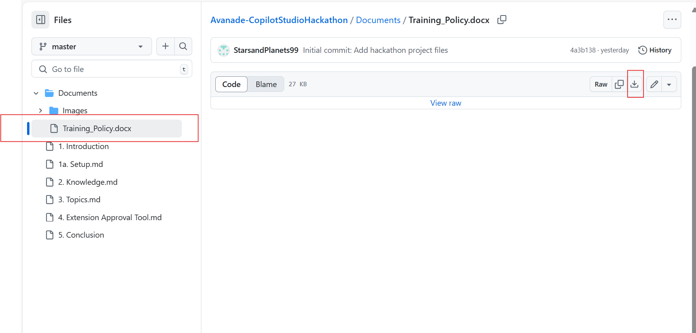
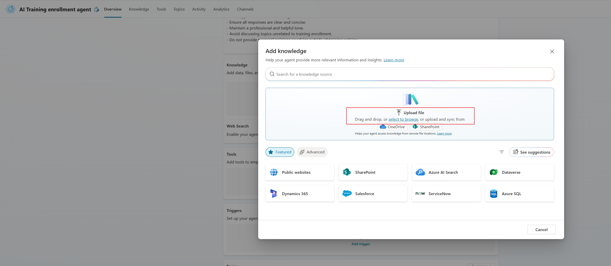
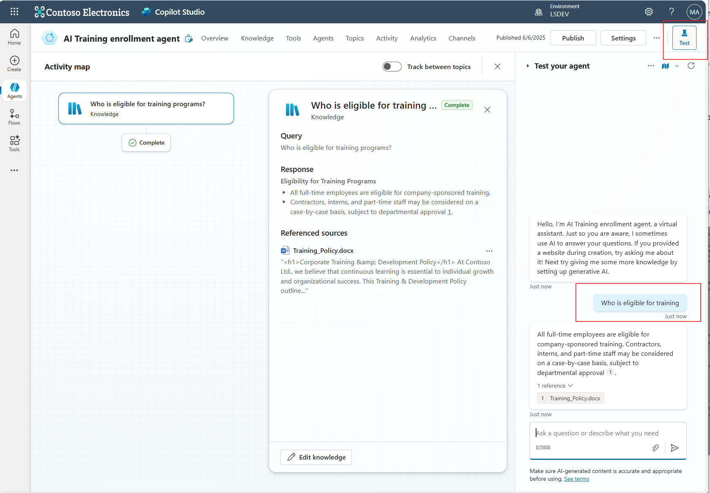

#  Copilot Studio Lab: Add a Knowledge Source to the Training Enrollment Agent

This guide walks you through adding a knowledge source to your beginner-level **Training Enrollment Agent** agent in Microsoft Copilot Studio.

---

## Step 1: Create the Agent

1. Go to [Copilot Studio](https://copilotstudio.microsoft.com).
2. Click on **“Agents”** in the left-hand menu.
3. Click **“+ New agent.”** and **Skip to configure**
4. Fill in the following:
   - **Name**: `Training Enrollment Agent`
   - **Description**:  
     _Helps employees find, enroll in, and check progress on training courses. Also answers training policy questions._
    - **Instructions**: 
        - _Provide training policy guidance to users._
        - _List available training programs._
        - _Calculate the cost of training programs._
        - _Send approval emails for training enrollment._
        - _Ensure all responses are clear and concise._
        - _Maintain a professional and helpful tone._
        - _Avoid discussing topics unrelated to training enrollment._
        - _Do not provide personal opinions or advice outside of training policies._
5. Click **Create**

---

## 📎 Step 2: Download the Knowledge Source

1. Download the Word Document from Github under the Documents Folder 

 

  

##  Step 3: Upload the Training Policy

  

1. Select Knowledge in  Copilot Studio 
2. Select and upload the file: `Training_Policy.docx`
3. Click **Add**

##  Step 4: Test Your Agent

Click the **Test your copilot** button in the top right.

Try asking questions like:
- `"Who is eligible for training?"`
- `"Do I need approval for training?"`
- `"Will the company pay for my certification exam?"`
- `"Is training time considered paid work?"`

  

##  Well Done!

Your Training Enrollment Agent now knows how to answer questions about the company’s training policy.

