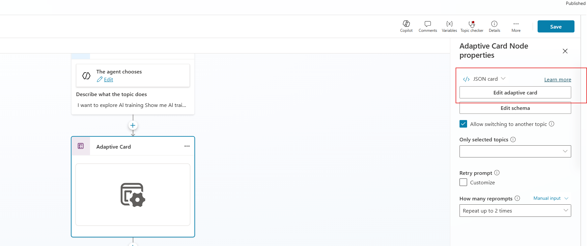

#  AI Training Course Chooser – Copilot Studio Topic (Low-code Only)

This Copilot Studio topic lets users choose a training course and receive a costed message for **Low-code Agentic AI development**.


##  Step 1: Create a New Topic

1. In **Copilot Studio**, go to the left menu and click **Topics**.
2. Click **+ New topic**.
3. Name the topic:
 

AI Training Course Chooser

 
4. In the **Trigger phrases** box, enter:
 

I want to explore AI training
Show me AI training categories
Help me find the right training

 `
5. Click **Create** to start designing the topic.


##  Step 2: Show Training Options with Adaptive Card

1. In the authoring canvas, click `+` and add a **Ask an adaptive card** node.
2. Click the `</>` icon to switch to code view.
3. Paste the following **Adaptive Card JSON**:


<p align="center">
  
</p>

<p align="center">
  
</p>


```json
{
  "type": "AdaptiveCard",
      "$schema": "https://adaptivecards.io/schemas/adaptive-card.json",
      "version": "1.5",
  "body": [
    {
      "type": "TextBlock",
      "text": "Select a Training Category",
      "weight": "Bolder",
      "size": "Medium"
    },
    {
      "type": "Input.ChoiceSet",
      "id": "trainingCategory",
      "style": "expanded",
      "choices": [
        {
          "title": "Low-code Agentic AI development",
          "value": "lowcode"
        }
      ]
    }
  ],
  "actions": [
    {
      "type": "Action.Submit",
      "title": "Continue"
    }
  ],
  "$schema": "http://adaptivecards.io/schemas/adaptive-card.json",
  "version": "1.5"
}
```


4. Click **Done**.
5. Store the value of `trainingCategory` in a variable named:

    
   trainingCategory
    
<p align="center">
  
</p>

6. Test
 <p align="center">
  
</p>