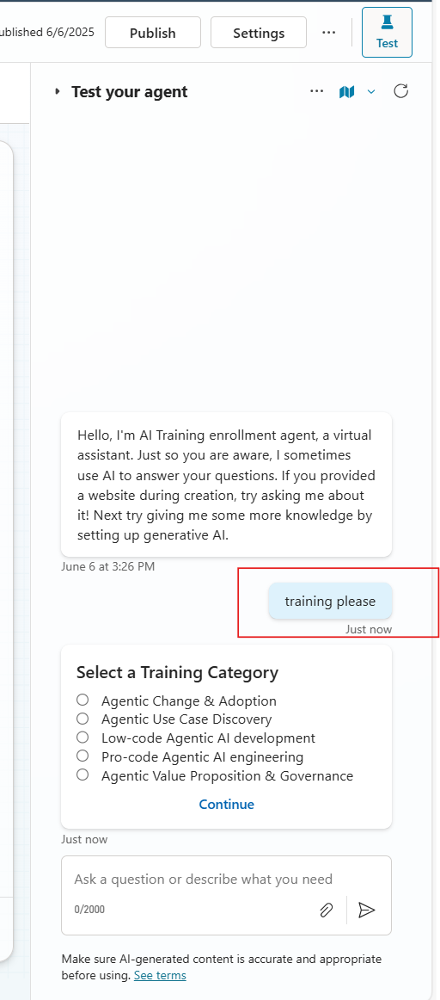

#  AI Training Course Chooser – Copilot Studio Topic

This Copilot Studio topic lets users choose a training course and receive a costed message for **Low-code Agentic AI development**.


##  Step 1: Create a New Topic

1. In **Copilot Studio**, go to the top menu and click **Topics**.
2. Click **+ Add a topic** from blank.
3. Name the topic: **AI Training Course Chooser** by overwriting **untitled**.

 
4. In the **Trigger phrases** box, in  **Describe what the topic does** enter:
 

I want to explore AI training
Show me AI training categories
Help me find the right training

 `
5. Click **Save** to start designing the topic.


##  Step 2: Show Training Options with Adaptive Card

1. In the Topics authoring canvas under the trigger phrases you entered, click `+` and select a **Ask with adaptive card** node.
2. Click inside the card to switch and select Edit adaptive card from the right hand side panel
3. Paste the following **Adaptive Card JSON**:


<p align="center">
  
</p>

<p align="center">
  
</p>


```json
{
    "type": "AdaptiveCard",
    "$schema": "https://adaptivecards.io/schemas/adaptive-card.json",
    "version": "1.5",
    "body": [
        {
            "type": "TextBlock",
            "text": "Select a Training Category",
            "wrap": true,
            "weight": "Bolder",
            "size": "Medium"
        },
        {
            "type": "Input.ChoiceSet",
            "id": "trainingCategory",
            "style": "expanded",
            "choices": [
                {
                    "title": "Agentic Change & Adoption",
                    "value": "facilitation"
                },
                {
                    "title": "Agentic Use Case Discovery",
                    "value": "discovery"
                },
                {
                    "title": "Low-code Agentic AI development",
                    "value": "lowcode"
                },
                {
                    "title": "Pro-code Agentic AI engineering",
                    "value": "procode"
                },
                {
                    "title": "Agentic Value Proposition & Governance",
                    "value": "governance"
                }
            ]
        }
    ],
    "actions": [
        {
            "type": "Action.Submit",
            "title": "Continue"
        }
    ]
}
```


4. Click **Done**.
5. Store the value of `trainingCategory` in a variable named:

    
   trainingCategory
    
<p align="center">
  
</p>

6. Test
 <p align="center">
  
</p>