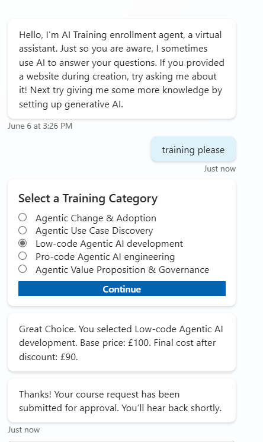

#  AI Training Course Chooser – Copilot Studio Prompt within a Topic

This Copilot Studio topic lets users choose a training course and receive a costed message for **Low-code Agentic AI development**.

##  Step 1: Add a Prompt to the Topic to Generate the Course Message

1. Click `+` and choose **Add a tool, New prompt**.

2. Create a new prompt called:   **CostPrompt Calculator**
    
 

  

3. Under **Input**, pass the variable:

    
   trainingCategory
    

4. Paste the following prompt instructions:

 
_Based on the selected training category, return a message like:_

_"Great Choice. You selected [Course Name]. Base price: £X. Final cost after discount (if applicable): £Y."_

_Course mappings:_
_- change: "Agentic Change & Adoption", £120_
_- discovery: "Agentic Use Case Discovery", £90_
_- lowcode: "Low-code Agentic AI development", £100_
_- procode: "Pro-code Agentic AI engineering", £200_
_- governance: "Agentic Value Proposition & Governance", £110_

Rules:
_- Apply 10% discount for "lowcode" or "discovery" categories._
_- Return only the message, no explanation or JSON._

_Use input variable: **trainingCategory**_

 

  

 
 5. Now add the input variable trainingCategory. You need the course chosen in the agent chat to be used in the prompt to provide the cost of the course

 

  

 

  

6. Test the prompt
 

  

7. Click **Save**.

8. Check the **Input trainingCategoy is filled in by cicking...and selecting trainingCategory**

9. Set the **Output** variable to:  **promptOutput**

 

  

  
    

## 💬 Step 2: Display the Result

1. Click `+` and add a **Message** node.
2. In the message box, click nthe {x} abd select the variable promptOutput

 

  

    
   
    

##  Step 3: End the Topic

1. Click `+` and add another **Message** node:

    
Thanks! Your course request has been submitted for approval. You’ll hear back shortly.

##  Step 4: Test
 

  

    

 

