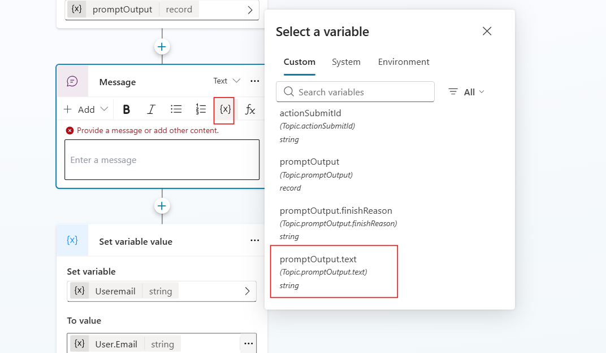

#  AI Training Course Chooser – Copilot Studio Prompt within a Topic

This Copilot Studio topic lets users choose a training course and receive a costed message for **Low-code Agentic AI development**.

##  Step 1: Add a Prompt to the Topic to Generate the Course Message

1. Click `+` and choose **Add a tool, New prompt**.

2. Create a new prompt called:   **CostPrompt Calculator**
    
 

  

  

    

3. Paste the following prompt instructions under **Instructions**:

 <pre>
Based on the selected training category, return a message like:

"Great Choice. You selected [Course Name]. Base price: £X. Final cost after discount (if applicable): £Y."

Course mappings:
- change: "Agentic Change & Adoption", £120
- discovery: "Agentic Use Case Discovery", £90
- lowcode: "Low-code Agentic AI development", £100
- procode: "Pro-code Agentic AI engineering", £200
- governance: "Agentic Value Proposition & Governance", £110

Rules:
- Apply 10% discount for "lowcode" or "discovery" categories.
- Return only the message, no explanation or JSON.

Use input variable: trainingCategory
 </pre>

 

  

4. Under **Instructions**, and next to the last line **Use input variable: trainingCategory**
, use '/' to add an input or click on the button ***Add Content***, and select Text. 

Name the input "trainingCategory" and as sample text add **low code**:

  

 
5. Test the prompt
 

  

7. Click **Save and close** the prompt.

8.  Go to the **Inputs** of the prompt box in Topics and click on the **Input trainingCategory** and fill in by clicking ... and selecting **trainingCategory**: 

  

9. Select the arrow on **Outputs** and create a new variable. Rename the **Output** variable to:  **promptOutput**

 

  

 

  

  

## 💬 Step 2: Display the Result

1. Click `+` and add a **Message** node.
2. In the message box, click the {x} abd select the variable promptOutput

 

  

    
   
    

##  Step 3: End the Topic

1. Click `+` and add another **Message** node:

    
**Thanks! Your course request has been submitted for approval. You’ll hear back shortly.**

 

  

##  Step 4: Test
 

  

##  Step 5: Publish your agent

Select publish on the top right hand side of the screen

    

