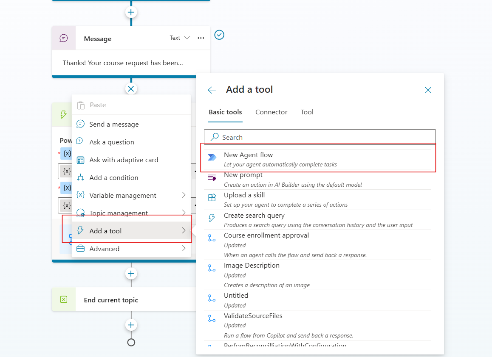
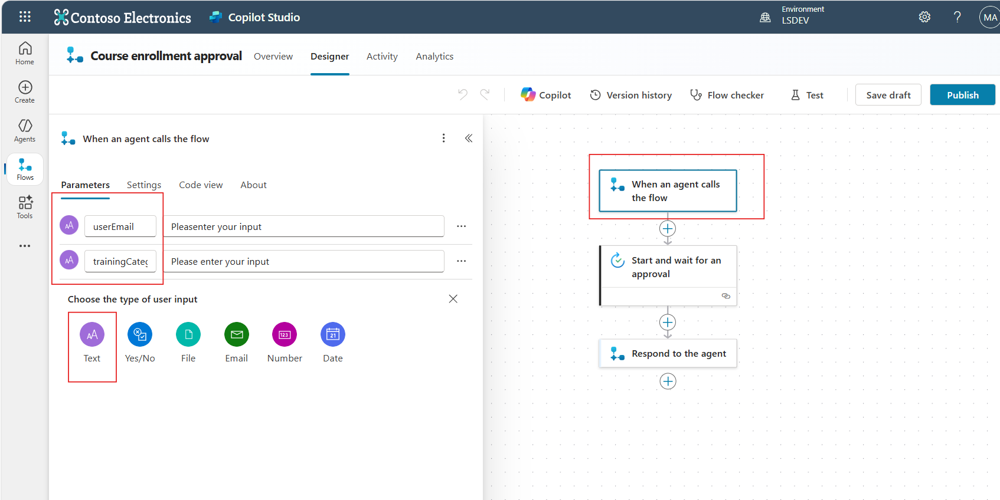
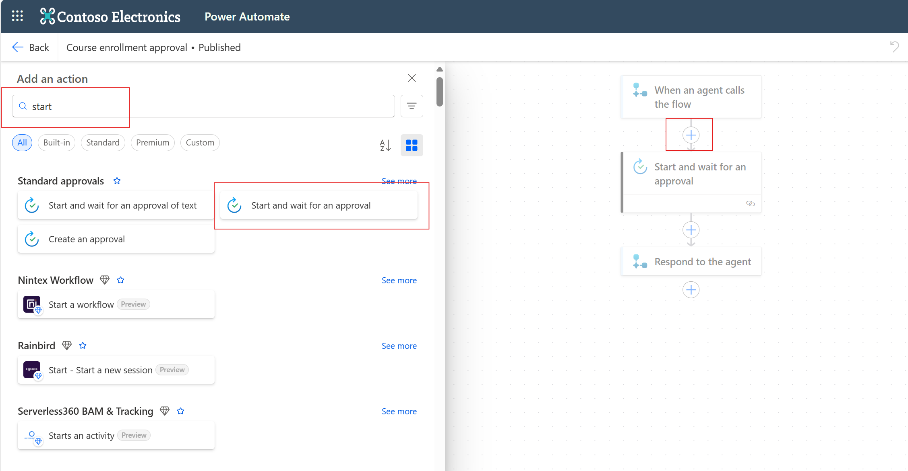
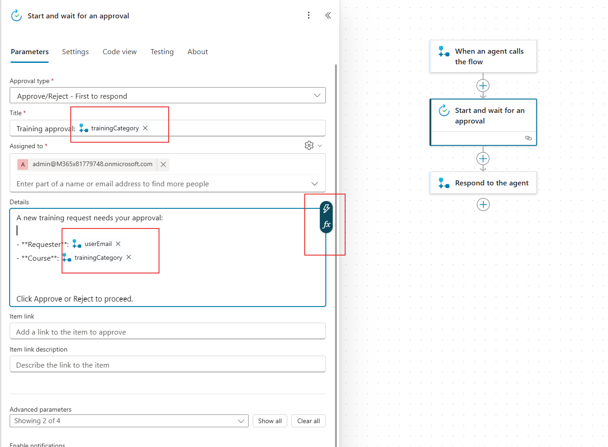
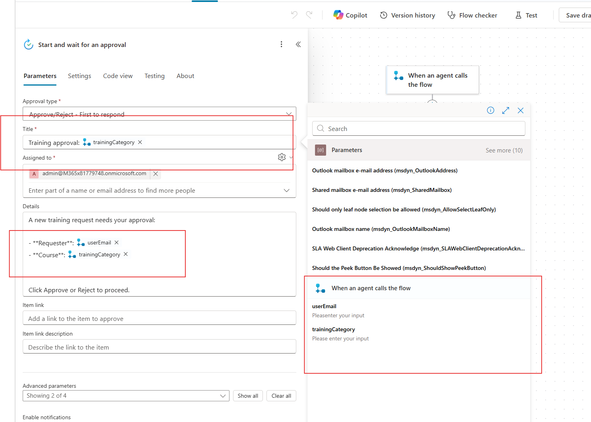
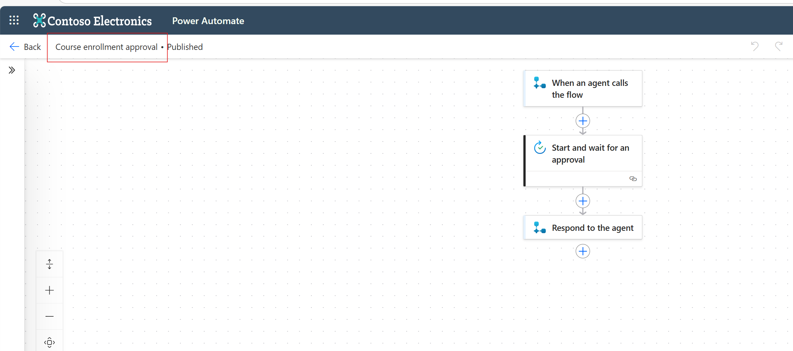
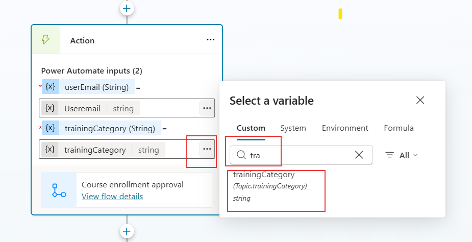
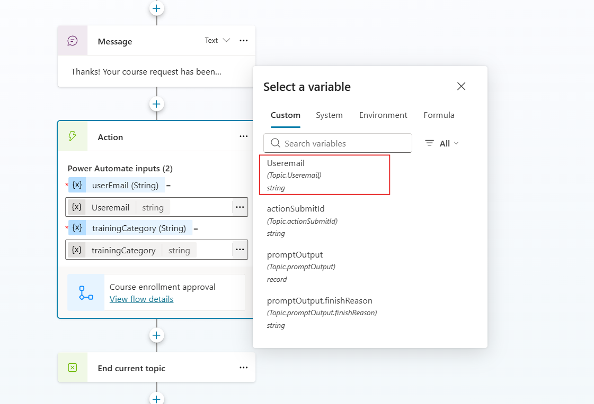
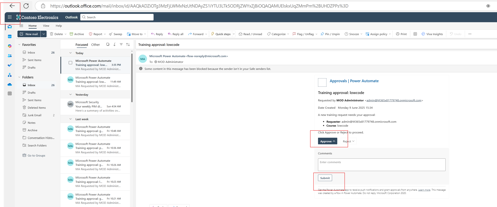

# Adding Approval Flow to the Course Chooser Topic

This guide shows you how to send an approval request after a user selects a training course in Copilot Studio. The flow uses **Agent Flows** and sends the request to a hardcoded email address for ease of creation.

## Step 1: Create the Agent Flow

1. In **Copilot Studio**, go to your Topic 
2. Click **+ Add a tool**.
3. Choose **New agent flow**.
4. Name the flow: **Course enrollment approval**

 

  

### Step 2: Add the Input Parameters:
Select when an agent calls the flow **+ Add Text Input** and create the following two string inputs:
- `userEmail`
- `trainingCategory`

 

  

## Step 3: Add the Approval Action

1. Click **+ New action** and search for: **Start and wait for an approval**

 

  

2. Complete the parameters:

Use Dynamic Content where needed by clicking in the box and then selecting the lightning symbol:

 

  

3. Configure the approval:

- **Approval type**: Approve/Reject – First to respond
- **Title**: Training approval: Select the dynamic content ['trainingCategory']}
  
- **Assigned to**:  your hackathon email address
  
- **Details**:
  
  A new training request needs your approval:

  - **Requester**: dynamic content ['userEmail']
  - **Course**: dynamic content ['trainingCategory']

 - ** Click Approve or Reject to proceed.**
  

4. (Optional) Add another action to notify the user or log the decision.

5. Save and publish the flow.

6. Rename the flow **Course enrollment approval** by double clicking on untitled:

## Step 3: Call the Flow from Your Topic

In your **Copilot Studio topic** (after the new prompt message):

1. Click `+` and choose **Add a tool → Search for your flow - **Course enrollment approval****.
2. Select the flow:  Course enrollment approval

3. Map the inputs:
- `userEmail` → use the variable `User.Email` (create it earlier using "Set variable")
- `trainingCategory` → use the variable from the Adaptive Card

>  If you haven't already captured the user’s email:
> - Use **Set variable** step before this:  
>   `Set variable: userEmail = User.Email`

  

  

  

  

## Step 4: Handle Authentication

If you see a message like:

Let’s get you connected first.

Click **Open connection manager**, log in, and make sure the flow shows **Connected** status.

##  Step 5: End the Topic

1. After the Power Automate action, click `+`.
2. Add a **Message** node:

Thanks! Your course request has been submitted for approval. You'll receive a response soon.

3. Add `End current topic`.

 Done! Your agent will now send an approval email when a user chooses a training course.

4. Test your flow. Check your Hackathon Account Email to approve the email
  

  

 

  

