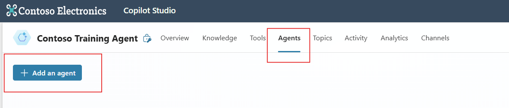

# Contoso Training Agent: Multi-Agent Setup with Copilot Studio

This exercise demonstrates how to build a multi-agent solution in **Microsoft Copilot Studio**, combining both **child agents** and **connected agents** for a training support agent.

## Overview

Copilot Studio lets you enhance your agents by connecting them to other agents, allowing them to hand off user interactions.

### Agent Types

- **Child Agent**  A lightweight agent that lives within your main agent. It functions similarly to tools and topics.

- **Connected Agent**  A standalone, full-featured agent, independent from your main agent. Currently, Copilot Studio supports:
  - Other Copilot Studio agents in the same environment
  - Microsoft Fabric data agents

## When to Use Child Agents

Use **child agents** in the following scenarios:

- A single developer or small, cohesive team manages the entire solution
- Logical grouping of tools, instructions, and knowledge into sub-agents is desired
- No need for separate configuration, authentication, or deployment
- No intent to publish or reuse sub-agents across multiple parent agents

---

##  Exercise Goal

We will create a multi-agent that: 

- Guides users to relevant **external training resources**
- Assists users with **internal training enrollment**
- Uses the **Copilot Studio AI Enrollment Agent** developed in Exercises 2–4

For experimental purposes you will create a child agent and a connected agent

## ✅ Step 1: Create the Parent Agent

Create a new agent and name it: **Contoso Training Agent**

## ✅ Step 2: Give instructions
Staying in the Overview tab, paste the following into the **Instructions** section  (Note we will add the blue icons and agents at a later stage). It should automatically save the instructions. 

<pre>  
You are an AI Training Assistant. 
Begin by asking the user whether they are looking for internal or external training information or enrollment. 
If they choose external, then use this agent: External Training Agent. 
If they choose internal, and want to know what courses are available, then use this agent. 

</pre>

 

  

## ✅ Step 3: Create a child agent
Select the Agents tab and click on **add an agent** and select create an agent. Name the agent **External Training Agent**

 

  

 

  

## ✅ Step 4: Write a Description and Add to the Instructions 

Add a description such as **External exam course information**

Add this content to the **Instructions:
<pre>
When an external exam course is needed bring back suitable AI courses and exams from from the Microsoft website only</pre>

 ## ✅ Step 5: Add Knowledge
 In the **Knowledge** section, select public website and copy the following link **https://learn.microsoft.com/en-us/credentials**

 

  

 

  

Save the Agent

 ## ✅ Step 6: Test the Agent

Test your agent in the test panel. Ask for training and then external when the choice is given. Note that we did not provide a topic but instead pasted  the instructions of the parent Agent in Step 1 

 

  

 ## ✅ Step 7: Add the Connected Agent: AI Enrollment Training Agent

 Now  add the internal agent AI Enrollment Training Agent created in Copilot Studio in Exercises 2-4

 

  

 

  

 

  

 ## ✅ Step 8: Add the Agents to the Parent Agent Instructions

Return to the Overview tab and scroll to the Instructions

Add the internal and external agents to the relevant lines by entering / and then selecting the agents
 

  

 ## ✅ Step 9: Test the Agents 

Test your agent by messaging it with a request for internal training.

Note:
- The agent will return general information unless you specifically ask about internal courses.
- You may encounter an error when selecting a course — this is expected at this stage and will be addressed by Microsoft in future releases.

 

  

## ✅ Step 10: Experiment

Change the **knowledge** settings and enable agents to connect **Let other agents connect to and use this one**.

Ensure to clear the testing pane each time. Are the results improved, the same or worse? 

 

  

 

  

🎉 **Well done — youv have successfully completed the lab!**  

You've built and tested a Copilot Studio multi-agent that handles internal and external training queries.

 Feel free to continue improving the agent or explore the next lab.