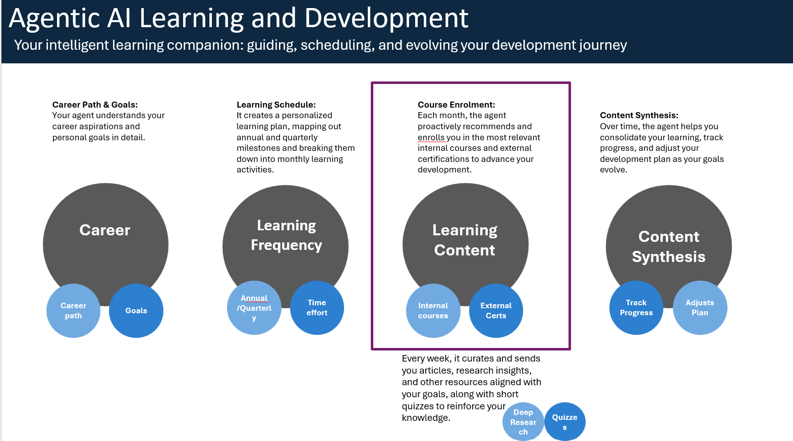
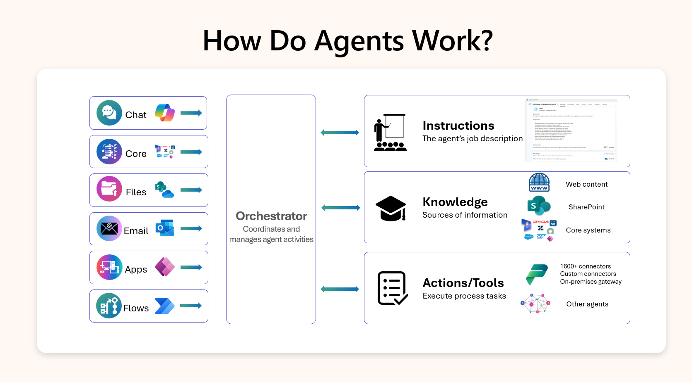

# AI Training Enrollment Agent Lab Overview
  

# Training Request Scenario – Agentic AI Course

  
## Overview:
This lab simulates a scenario where an employee wishes to enroll in a training course on Agentic AI. The AI assistant is designed to support the entire process — from providing training policy information to facilitating course selection, calculating costs, and initiating approval workflows. The goal is to demonstrate how conversational AI can streamline employee development requests while ensuring compliance with organisational policies. In the optional multi-agent extension, you will expand the solution to include a parent agent that routes users to either:

- an internal training enrollment agent (the one built in this lab), or
- an external training agent that retrieves course and certification info from public Microsoft resources.

This demonstrates how different copilots can collaborate to deliver a seamless experience across multiple domains.

 

  

   

## Scenario Objectives:

### Policy Awareness
The AI assistant must be able to answer questions regarding:

- Eligibility for training
- The process for requesting training
- Reimbursement of exam or certification fees
- Whether time off is provided for training participation

### Course Discovery & Cost Calculation
The AI assistant should:

- Present available Agentic AI training courses
- Provide up-to-date pricing information, including:
  - Standard course fees
  - Real-time calculations for discounts or bundled offers
- Offer course prerequisites or certification track info if applicable

### Multi-Agent Extension

When the user expresses interest in external training or certifications, the parent agent should:
- Route the conversation to either the **External Training Agent** or the **AI Enrollment Agent**
- Retrieve relevant **external AI certifications and courses** from trusted sources (e.g. [Microsoft Learn](https://learn.microsoft.com/en-us/credentials))
- Return control to the parent agent or conclude the session as appropriate

## Expected Outcomes:

- A conversational AI experience that helps employees make informed training decisions
- Automated calculation logic that ensures cost transparency
- The assistant can now handle both internal and external training requests by connecting to different agents and shows how multiple agents can work together smoothly
 

## Key Capabilities You’ll Learn
| Feature / Pattern                      | What You'll Learn & Do                                                      |
|---------------------------------------|------------------------------------------------------------------------------|
| **Knowledge Q&A (RAG)**               | Upload a Word doc and enable generative answers for training policy queries |
| **Topics with Adaptive Cards**        | Collect structured input using choice sets inside a conversation            |
| **Prompt Engineering**                | Use prompt flows to dynamically calculate course cost                       |
| **Variable Management**               | Store and use topic-level and prompt-level variables                        |
| **Multi-Agent Routing**               | Connect and switch between copilots for internal and external training paths |
| **End-to-end testing**                 | Preview and test the agent in Copilot Studio’s built-in chat simulator      |
| **Agent Flows (optional)**            | Trigger an approval flow and handle responses in the agent                  |

       

  

       

---
